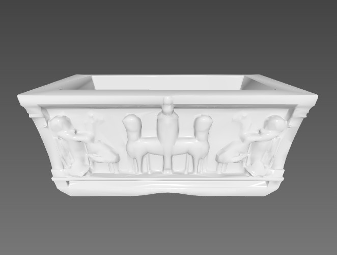
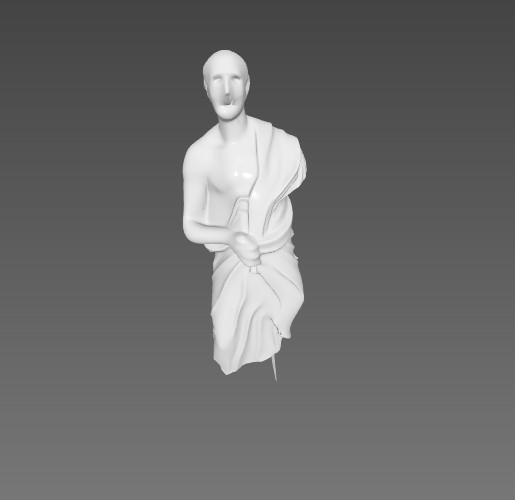
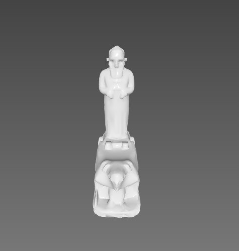
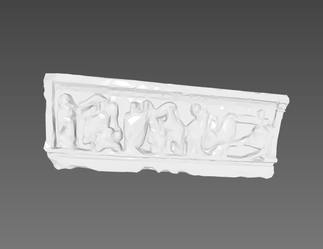
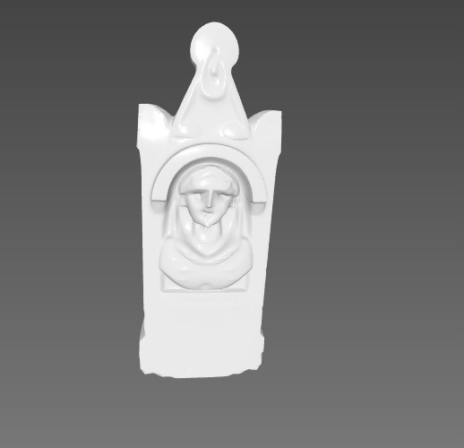

[](https://classroom.github.com/a/A98mEP3-)
# Virtual Museum Assignment

<p align="center">
  
  
  
  
  
</p>


### 📌 About the Project
This is a **Virtual Museum** project developed in **C++ with OpenGL**, enhanced by 3D models imported from **Blender**. A mobile robot automatically moves across the room, scanning objects, showing a **rotating animation** and displaying an **information popup**.

### 🚀 Features
- Real-time 3D graphics with OpenGL 3.3 Core
- Lighting via shaders (ambient + diffuse)
- `.obj` model import support (via Assimp)
- Mobile robot animation and pathing
- Auto-rotation for scanned objects + popup info
- Transparent ImGui control panel
- Scanning sound and completion sound effects
- **Assimp support** integrated via `vcpkg`

### 🗂️ Project Structure
```
📁 imgui/               → User interface components (robot control panel, information popup)
📄 Room.cpp/.h          → Museum scene setup, object placement, and robot movement management
📄 Shader.cpp/.h        → Shader program loader and GPU uniform handling
📄 ModelLoader.cpp/.h   → Loading 3D `.obj` models exported from Blender using Assimp
📄 Primitives.cpp/.h    → Procedural drawing of the robot and its moving parts using basic shapes
📄 vertex_shader.glsl   → Vertex transformations and normal calculations for lighting
📄 fragment_shader.glsl → Final lighting color computation (ambient and diffuse)
📄 main.cpp             → Main application loop and initialization logic
```

### 🛠️ Required Libraries
- [GLFW](https://www.glfw.org/)
- [GLAD](https://glad.dav1d.de/)
- [GLM](https://github.com/g-truc/glm)
- [Dear ImGui](https://github.com/ocornut/imgui)
- [Assimp](https://github.com/assimp/assimp) via `vcpkg`

### 🧰 Build Instructions (Windows – Visual Studio)
1. Open Visual Studio 2022
2. Load the provided `Proje.sln` file
3. Install dependencies via `vcpkg` (especially Assimp)
4. Build and Run in `Debug` or `Release`

### 🖼️ Adding Blender Models
- Copy your `.obj` and `.mtl` files to the project
- Integrate in `ModelLoader.cpp` at proper index

## 🎥 Demo Video (Download to Watch)

📁 The demo video of this project is available in this repository as `project-record.zip`.  
To watch:
1. Download the `project-record.zip` file
2. Extract the archive
3. Open the `.mp4` video file inside

📢 **Note: The video includes sound. Scan and completion effects are audible.**

## 🎥 Watch the Demo on YouTube
🔗 [https://www.youtube.com/watch?v=dV20bnGXTvc](https://www.youtube.com/watch?v=dV20bnGXTvc)

📢 **Note: The video includes sound. Scan and completion effects are audible.**
---
